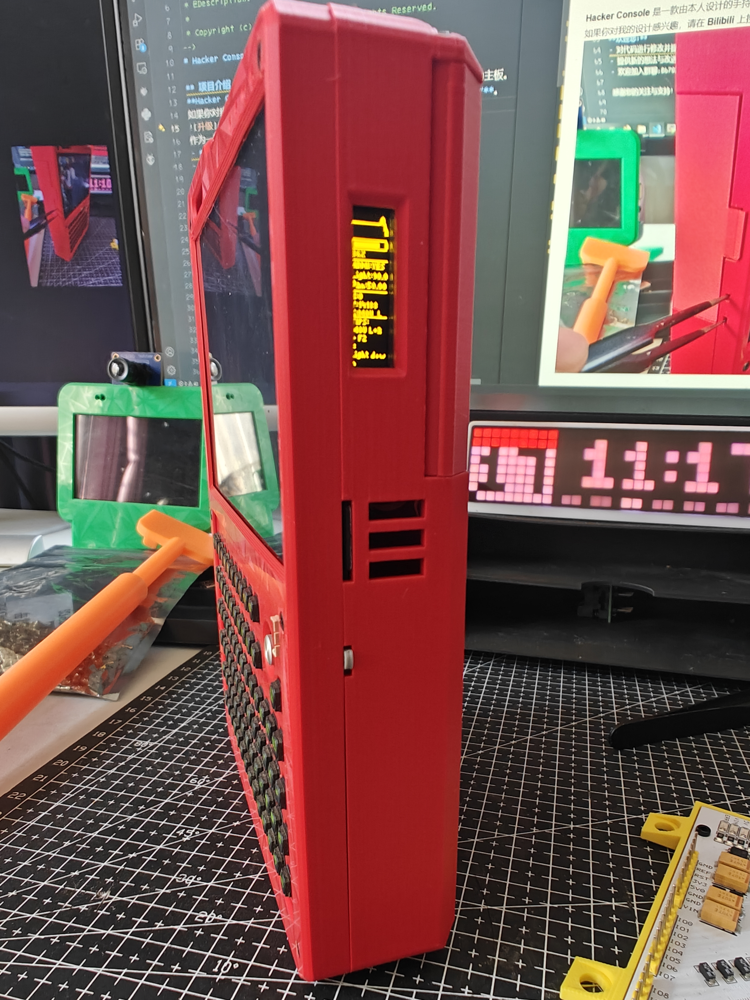
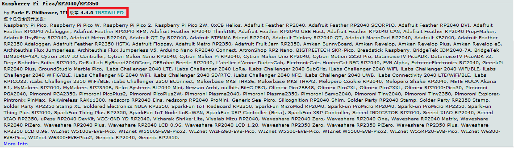
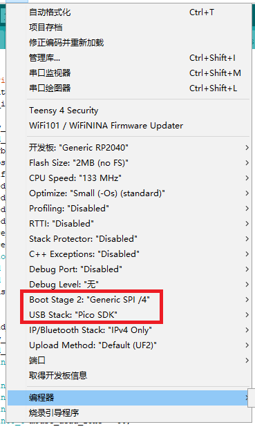
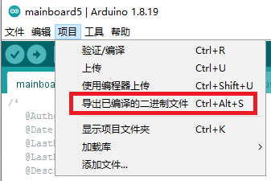
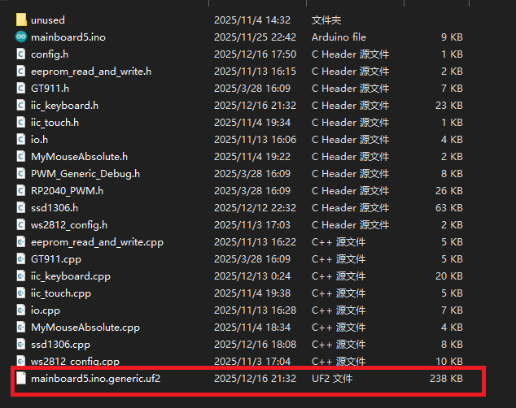
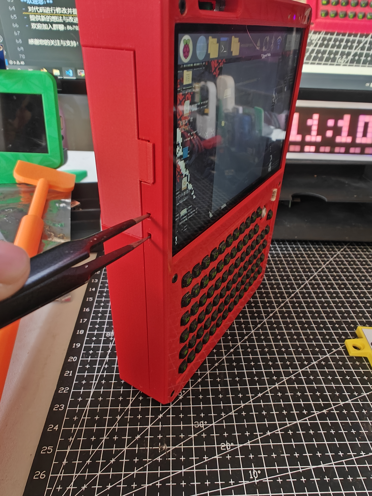

<!--
 * @Author: 无序熵增
 * @Date: 2025-12-11 22:22:40
 * @LastEditors: 无序熵增
 * @LastEditTime: 2025-12-17 11:20:54
 * @Description: 
 * 
 * Copyright (c) 2025 by 无序熵增, All Rights Reserved. 
-->
# Hacker Console 固件源码

## 项目介绍
**Hacker Console** 是一款由本人设计的手持终端，采用树莓派 B 系列作为主板。  
如果你对我的设计感兴趣，请在 **Bilibili** 上搜索 **“Hacker Console”**。
 <!-- 添加板子图片 -->
 <!-- 添加板子图片 -->
作为一款拓展性极强的手持终端，它具有以下特性：
- **免驱动的 HDMI 屏幕**，支持触摸功能
- 键盘采用 **HID 协议**，通过 **USB 通信**，即插即用
- 键盘为独立 PCB 设计，可替换
- 配备一块**副屏**，用于显示设备状态
- 提供 **GPIO 引脚引出**
- **外壳设计开源**

## 固件说明
这里提供主控板上运行的程序，包含两个单片机的程序。

### 键盘模块程序
由于有新、旧两个键盘版本，请根据您手中的键盘版本选择对应的程序。  
（一般情况下，到手的键盘均已烧写好固件。）

- **新键盘**：请使用 `newkeyboard3` 文件夹下的程序
- **旧键盘**：请使用 `keyboard2` 文件夹下的程序

### 主板程序
主控板程序位于 `mainboard5` 文件夹中。

## 编译说明
### 环境要求
- 使用 **Arduino IDE**，并安装 **RP2040 编译包**
- **务必**下载 **4.4 版本** 的RP2040编译包
 <!-- 添加板子图片 -->
### 编译设置
1. **Boot Stage 2**：选择 **Generic SPI/4**
2. **USB Stack**：设置为 **“PICO SDK”**
 <!-- 添加板子图片 -->
### 编译步骤
- 使用快捷键 **`Ctrl + Alt + S`** 进行编译，固件将导出至项目文件夹
- 编译结果是一个 **`.uf2`** 格式的文件

 <!-- 添加板子图片 -->
 <!-- 添加板子图片 -->
## 烧录指南
### 键盘固件烧录
键盘程序需要**使用烧录器单独烧录**。  
如果您有能力修改代码，很可能会使用 **picoprobe** 来烧录固件。

### 主板固件升级
1. 使用设备左侧的两个小孔（每个孔内有一个按键）
2. **按住上面的按键**，然后**按一下下面的按键**
 <!-- 添加板子图片 -->
3. 树莓派系统将识别出一个 **U盘**
4. 将编译好的 **`.uf2`** 固件文件放入该U盘中，即可完成升级
 <!-- 添加板子图片 -->
## 贡献与反馈
**欢迎您：**
- 对代码进行修改并提交
- 提供新的想法与改进建议
- 欢迎加入群聊：867028792来和我取得联系

感谢您的关注与支持！

